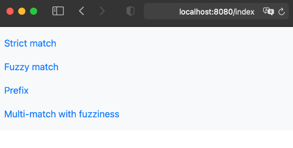
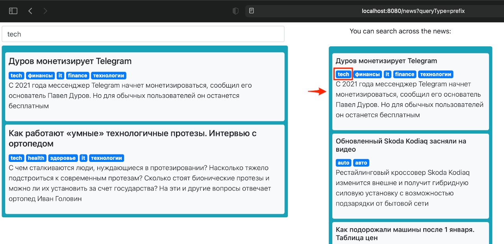
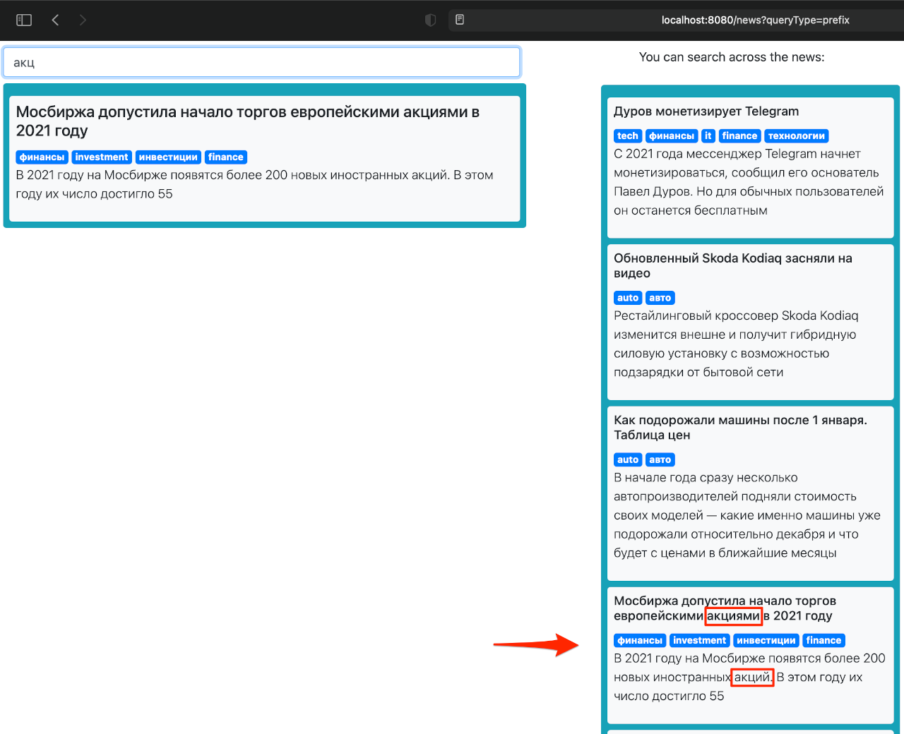
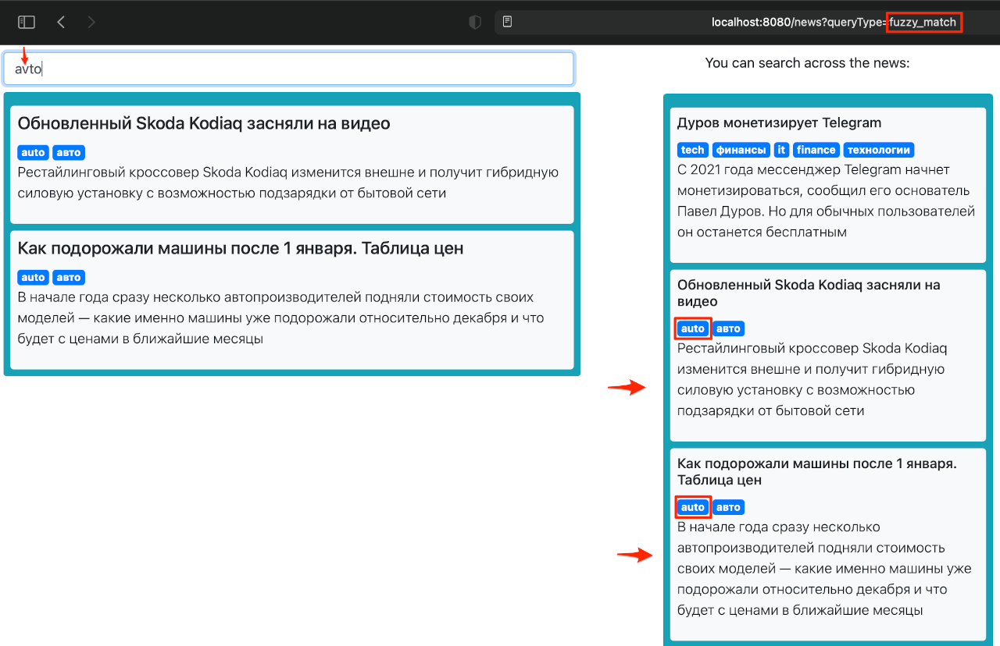

## Прототип поиска по статьям с использованием движка Elasticsearch

### Что из себя представляет приложение
* Есть набор новостных "статей" со следующей структурой (см. файл `news.json`)
```
{
    "title": "title_text",
    "body": "body_text",
    "tags": [
      "tag1",
      "tag2"
    ]
}
```  
* При старте все они грузятся в эластик в индекс _blog_
* После остановки индекс полностью удаляется
* Есть несколько шаблонов поиска: строгое соответствие (match), нечеткий поиск (fuzzy), по старту строки (prefix) и др. (см. [Query DSL](https://www.elastic.co/guide/en/elasticsearch/reference/current/query-dsl.html))
* После старта приложения можно перейти на http://localhost:8080/index (или где оно было запущено), и оттуда будут доступны опции различных режимов поиска с использованием соответствующих шаблонов

* В строке поиска можно вводить любой запрос. Поиск будет выполняться по всем полями: `title`, `body`, `tags`. Результаты могут отличаться в зависимости от выбранного режима. В правой колонке для примера выведены все имеющиеся "статьи", по которым выполняется поиск (берутся также из индекса эластика)
  
  
  


### Пререквизиты
* Запустить Elasticsearch на основе docker-compose файла `elastic.yml`
* Если инстанс эластика запущен в другом месте, либо хост/порт отличаются вот дефолтных, то подправить параметры в `application.yml`, либо запустить с соответствующими переопределенными системными переменными
```
elastic:
  host: localhost
  port: 9200
```

### Если надо добавить или изменить "статьи"
* Поправить файл `news.json`

### Если надо добавить новый механизм поиска
* Добавить шаблон с запросом в папку `searchTemplates` (см. [Query DSL](https://www.elastic.co/guide/en/elasticsearch/reference/current/query-dsl.html))
                                            
### Собрать и запустить приложение
* `cd docker`
* `./build_docker_image.sh`
* `docker-compose -f docker-compose-elastic.yml up`
* `docker-compose -f docker-compose-app.yml up`

                                                        
